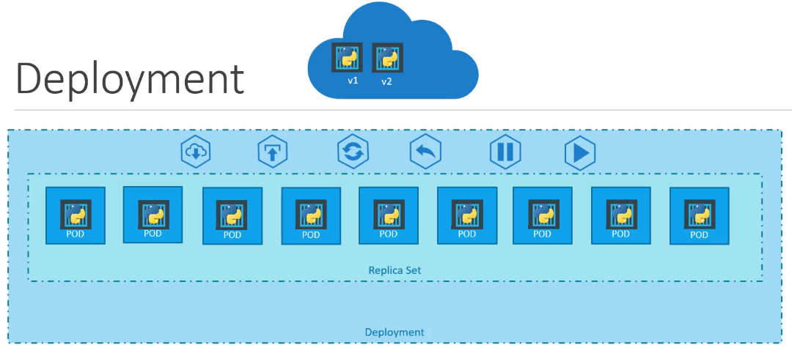

# Introduction Kubernetes Deployments

Kita akan belajar bagaimana Kubernetes bekerja dalam proses deployment. Kuberntes bisa memberikan beberapa tags *environment* sehingga kita bisa tahu deployment itu dengan label apa.

Mekanisme Kubernetes bekerja untuk memastikan sumber daya yang dibutuhkan ada di cluster dan mencapai keadaan yang diinginkan. Hal ini menghilangkan kebutuhan untuk memperbarui dan menyebarkan aplikasi secara manual, yang memakan waktu dan dapat menyebabkan kesalahan manusia.

Pada kesempatan ini kita hanya mencoba men-deploy PODs single instance dari aplikasi yang sudah kita buat. Dan kita akan mencoba juga men-*deploy* menggunakan *replication controllers* atau *replica set*.

Kubernetes Deployment ini jika kita lihat dibawah terdapat pada cangkupan hirarki paling atas yang mana kita bisa memanage PODs dan replica set dalam satu file.


## Membuat Kubernetes Deployment
Ketika kita ingin membuat file deployment Kubernetes tipe yang kita buat harunsya menggunakan
```yaml
kind: Deployment
```

Pada file deployment sama halnya seperti sebelumnya pada `ReplicaSet` tetapi yang berbeda hanya fields `kind` saja.

Kita coba buat file YAML dengan nama `deployment-definition.yaml` dengan isi seperti
```yaml
apiVersion: apps/v1
kind: Deployment
metadata:
  name: myapp-deployment
  labels:
    app: myapp
    type: front-end
spec:
  template:
    metadata:
      name: myapp-pod
      labels:
        app: myapp
        type: front-end
    spec:
      containers:
        - name: nginx-container
          image: nginx
  replicas: 4
  selector:
    matchLabels:
      type: front-end
```

Jika sudah selesai kita coba jalankan perintah dibawah untuk membuat proses deployment Kubernetes.
```bash
➜ kubectl create -f code/deployments/deployment-definition.yaml
```

Untuk melihat proses deployment sudah berjalan atau tidak bisa kita lihat dengan perintah ini.
```bash
➜ kubectl get deployments
NAME               READY   UP-TO-DATE   AVAILABLE   AGE
myapp-deployment   4/4     4            4           9s
```

Terlihat pada terminal tersebut proses deployment sudah berjalan dengan baik dan PODs sudah tersedia sebanyak 4.

lalu kita lihat replicaset dan PODs-nya dengan perintah ini
```bash
➜ kubectl get replicaset,pods
NAME                               DESIRED   CURRENT   READY   AGE
replicaset.apps/myapp-replicaset   4         4         4       4d20h

NAME                         READY   STATUS    RESTARTS   AGE
pod/myapp-replicaset-l568n   1/1     Running   0          4d20h
pod/myapp-replicaset-ppr52   1/1     Running   0          4d20h
pod/myapp-replicaset-rbhlp   1/1     Running   0          4d20h
pod/myapp-replicaset-rrqc2   1/1     Running   0          4d20h
```

Semua sudah berjalan dengan baik dan statusnya pun `Running` berarti tidak ada PODs yang error atau tidak berjalan dengan baik.

Jika kita ingin lebih detail apa saja informasi yang kita deploy bisa dengan perintah.
```bash
➜  kubernetes-for-beginners git:(main) ✗ kubectl describe deployment myapp-deployment
Name:                   myapp-deployment
Namespace:              default
CreationTimestamp:      Mon, 11 Mar 2024 14:15:46 +0700
Labels:                 app=myapp
                        type=front-end
Annotations:            deployment.kubernetes.io/revision: 1
Selector:               type=front-end
Replicas:               4 desired | 4 updated | 4 total | 4 available | 0 unavailable
StrategyType:           RollingUpdate
MinReadySeconds:        0
RollingUpdateStrategy:  25% max unavailable, 25% max surge
Pod Template:
  Labels:  app=myapp
           type=front-end
  Containers:
   nginx-container:
    Image:        nginx
    Port:         <none>
    Host Port:    <none>
    Environment:  <none>
    Mounts:       <none>
  Volumes:        <none>
Conditions:
  Type           Status  Reason
  ----           ------  ------
  Available      True    MinimumReplicasAvailable
  Progressing    True    NewReplicaSetAvailable
OldReplicaSets:  <none>
NewReplicaSet:   myapp-replicaset (4/4 replicas created)
Events:
  Type    Reason             Age    From                   Message
  ----    ------             ----   ----                   -------
  Normal  ScalingReplicaSet  4m57s  deployment-controller  Scaled down replica set myapp-replicaset to 4 from 8
```

Dan kita ingin lihat detail secara keseluruhan dari Cluster, PODs, Replicate dan Deployment kita bisa ketik dengan perintah ini.
```bash
➜ kubectl get all
NAME                         READY   STATUS    RESTARTS   AGE
pod/myapp-replicaset-l568n   1/1     Running   0          4d20h
pod/myapp-replicaset-ppr52   1/1     Running   0          4d20h
pod/myapp-replicaset-rbhlp   1/1     Running   0          4d20h
pod/myapp-replicaset-rrqc2   1/1     Running   0          4d20h

NAME                 TYPE        CLUSTER-IP   EXTERNAL-IP   PORT(S)   AGE
service/kubernetes   ClusterIP   10.96.0.1    <none>        443/TCP   11d

NAME                               READY   UP-TO-DATE   AVAILABLE   AGE
deployment.apps/myapp-deployment   4/4     4            4           5m59s

NAME                               DESIRED   CURRENT   READY   AGE
replicaset.apps/myapp-replicaset   4         4         4       4d20h
``` 

## Update dan Rollback Kubernetes Deployments
Ketika kita sedang melakukan deployment Service kita, suatu ketika terjadi hal yang memang tidak diinginkan pada versi terbaru tersebut atau ditemukan `Error` yang mengakibatkan service kita tidak berjalan dengan baik.

Maka, kita perlu ada mekanisme *Rollout* untuk mengembalikan service kita ke versi yang stable atau sebelumnya.

Cara rollout ini kita bisa lakukan dengan perintah
```bash
➜ kubectl rollout status deployment/myapp-deployment 
deployment "myapp-deployment" successfully rolled out
```

Kita sudah mencoba rollout deployment, dan kita lihat perintah yang sudah kita lakukan dengan cara melihatnya
```bash
➜ kubectl rollout history deployment/myapp-deployment
deployment.apps/myapp-deployment 
REVISION  CHANGE-CAUSE
1         <none>
```

Misalkan kita akan simulasi ketika deployment yang kita terjadi hal yang membuat error. Ubah file YAML deployment yang sudah kita buat tadi pada
```yaml
replicas: 6
```

Agar kita lihat bagaimana status *rollout*-nya kita akan coba hapus terlebih dahulu deployment yang sebelumnya dengan perintah ini.
```bash
➜ kubectl delete deployment myapp-deployment 
deployment.apps "myapp-deployment" deleted
```

dan kita coba lagi buat ulang dengan perintah
```bash
➜ kubectl create -f code/deployments/deployment-definition.yaml
deployment.apps/myapp-deployment created
```

jika sudah create langsung jalankan perintah dibawah ini.
```bash
➜ kubectl rollout status deployment/myapp-deployment  
Waiting for deployment "myapp-deployment" rollout to finish: 0 of 6 updated replicas are available...
Waiting for deployment "myapp-deployment" rollout to finish: 1 of 6 updated replicas are available...
Waiting for deployment "myapp-deployment" rollout to finish: 2 of 6 updated replicas are available...
Waiting for deployment "myapp-deployment" rollout to finish: 3 of 6 updated replicas are available...
Waiting for deployment "myapp-deployment" rollout to finish: 4 of 6 updated replicas are available...
Waiting for deployment "myapp-deployment" rollout to finish: 5 of 6 updated replicas are available...
deployment "myapp-deployment" successfully rolled out
```

Bisa kita lihat status setiap PODs berjalan satu persatu untuk di deploy. Jika kita ingin menyimpan perintah-perintah yang sudah kita pakai maka kita bisa lakukan saat menjalankan buat deployment kita tambahkan `--record` seperti dibawah ini.
```bash
➜ kubectl create -f code/deployments/deployment-definition.yaml --record
Flag --record has been deprecated, --record will be removed in the future
deployment.apps/myapp-deployment created
```

Jika kita lihat memang flag `--record` ini kedepannya akan `decprecated` oleh tim Kubernetes tetapi saat ini masih kita bisa pakai.

Lalu kita lihat history perintah yang telah kita simpan dengan perintah dibawah ini.
```bash
➜ kubectl rollout history deployment/myapp-deployment
deployment.apps/myapp-deployment 
REVISION  CHANGE-CAUSE
1         kubectl create --filename=code/deployments/deployment-definition.yaml --record=true
```

Kita coba ubah file YAML yang sudah kita buat dengan merubah versi image dari container yang diset, misalkan kita akan upgrade ke versi `1.18` maka kita ubah dengan perintah ini.
```bash
➜ kubectl edit deployment myapp-deployment --record
Flag --record has been deprecated, --record will be removed in the future
deployment.apps/myapp-deployment edited
```

lalu cari containers image dan tambahkan menjadi seperti ini
```bash
- image: nginx:1.18
```

Dan akan terlihat hasilnya pada deskripsi menjadi seperti dibawah ini.
```bash
➜  kubectl describe deployment myapp-deployment      
Name:                   myapp-deployment
Namespace:              default
CreationTimestamp:      Mon, 11 Mar 2024 14:50:06 +0700
Labels:                 app=myapp
                        type=front-end
Annotations:            deployment.kubernetes.io/revision: 2
                        kubernetes.io/change-cause: kubectl edit deployment myapp-deployment --record=true
Selector:               type=front-end
Replicas:               6 desired | 6 updated | 6 total | 6 available | 0 unavailable
StrategyType:           RollingUpdate
MinReadySeconds:        0
RollingUpdateStrategy:  25% max unavailable, 25% max surge
Pod Template:
  Labels:  app=myapp
           type=front-end
  Containers:
   nginx-container:
    Image:        nginx:1.18
    Port:         <none>
    Host Port:    <none>
    Environment:  <none>
    Mounts:       <none>
  Volumes:        <none>
Conditions:
  Type           Status  Reason
  ----           ------  ------
  Available      True    MinimumReplicasAvailable
  Progressing    True    NewReplicaSetAvailable
OldReplicaSets:  myapp-deployment-84ccc5558 (0/0 replicas created)
NewReplicaSet:   myapp-deployment-7cd6f9c5d4 (6/6 replicas created)
Events:
  Type    Reason             Age                From                   Message
  ----    ------             ----               ----                   -------
  Normal  ScalingReplicaSet  7m58s              deployment-controller  Scaled up replica set myapp-deployment-84ccc5558 to 6
  Normal  ScalingReplicaSet  70s                deployment-controller  Scaled up replica set myapp-deployment-7cd6f9c5d4 to 2
  Normal  ScalingReplicaSet  70s                deployment-controller  Scaled down replica set myapp-deployment-84ccc5558 to 5 from 6
  Normal  ScalingReplicaSet  70s                deployment-controller  Scaled up replica set myapp-deployment-7cd6f9c5d4 to 3 from 2
  Normal  ScalingReplicaSet  45s                deployment-controller  Scaled down replica set myapp-deployment-84ccc5558 to 4 from 5
  Normal  ScalingReplicaSet  45s                deployment-controller  Scaled up replica set myapp-deployment-7cd6f9c5d4 to 4 from 3
  Normal  ScalingReplicaSet  43s                deployment-controller  Scaled down replica set myapp-deployment-84ccc5558 to 3 from 4
  Normal  ScalingReplicaSet  43s                deployment-controller  Scaled up replica set myapp-deployment-7cd6f9c5d4 to 5 from 4
  Normal  ScalingReplicaSet  40s                deployment-controller  Scaled down replica set myapp-deployment-84ccc5558 to 2 from 3
  Normal  ScalingReplicaSet  36s (x3 over 40s)  deployment-controller  (combined from similar events): Scaled down replica set myapp-deployment-84ccc5558 to 0 from 1
```

Pada fiels `Annotations` terlihat telah mendapatkan update revisi dengan nama `deployment.kubernetes.io/revision: 2` karena kita telah melakukan update terhadap container image versi nginx menjadi `1.18`.

Pada informasi containers pun sudah berubah menjadi seperti ini
```bash
Containers:
   nginx-container:
    Image:        nginx:1.18
```

Bagiaman ketika kita ingin mengupdate image container tersebut tetapi ternyata versi tersebut tidak tersedia atau anggaplah service kita terjadi error maka kita akan coba simulasikan dengan pertama kita update image dengan perintah dibawah ini.
```bash
➜ kubectl set image deployment myapp-deployment nginx-container=nginx:1.18-does-not-exist --record
Flag --record has been deprecated, --record will be removed in the future
deployment.apps/myapp-deployment image updated
```

Kita lihat terlebih dahulu history
```bash
➜ kubectl rollout history deployment/myapp-deployment
deployment.apps/myapp-deployment 
REVISION  CHANGE-CAUSE
1         kubectl create --filename=code/deployments/deployment-definition.yaml --record=true
2         kubectl set image deployment myapp-deployment nginx=nginx:1.18-does-not-exist --record=true
3         kubectl set image deployment myapp-deployment nginx-container=nginx:1.18-does-not-exist --record=true
```

Dan coba kita lihat detail setelah kita upgrade dengan image versi yang tidak ada, maka akan terlihat seperti ini
```bash
➜ kubectl get deployment,pods,replicaset
NAME                               READY   UP-TO-DATE   AVAILABLE   AGE
deployment.apps/myapp-deployment   5/6     3            5           16m

NAME                                    READY   STATUS             RESTARTS   AGE
pod/myapp-deployment-7cd6f9c5d4-bg67z   1/1     Running            0          9m15s
pod/myapp-deployment-7cd6f9c5d4-bt7qr   1/1     Running            0          9m15s
pod/myapp-deployment-7cd6f9c5d4-fvnrq   1/1     Running            0          8m45s
pod/myapp-deployment-7cd6f9c5d4-lqdwj   1/1     Running            0          9m15s
pod/myapp-deployment-7cd6f9c5d4-rksfz   1/1     Running            0          8m50s
pod/myapp-deployment-86c74f6c5d-fpv4n   0/1     ImagePullBackOff   0          2m1s
pod/myapp-deployment-86c74f6c5d-pz6hk   0/1     ImagePullBackOff   0          2m1s
pod/myapp-deployment-86c74f6c5d-sfbvb   0/1     ErrImagePull       0          2m1s

NAME                                          DESIRED   CURRENT   READY   AGE
replicaset.apps/myapp-deployment-7cd6f9c5d4   5         5         5       9m15s
replicaset.apps/myapp-deployment-84ccc5558    0         0         0       16m
replicaset.apps/myapp-deployment-86c74f6c5d   3         3         0       2m1s
```

Kita bisa lihat pada `deployment` terdapat status READY **5/6** itu artinya terdapat satu PODs yang sedang proses upgrade versinya tetapi terjadi error dan pada UP-TO-DATE terlihat ada 3 PODs baru yang akan menjalankan versi terbaru tetapi terjadi error, lalu status AVAILABLE ada 5 PODs yang mana ini masih pada versi sebelumnya.

Kalau kita lihat lebih detail lagi maka pada PODs terlihat 3 dengan status `ImagePullBackOff` atau `ErrImagePull` dan 5 dengan status `Running`.

Kubernetes ini ketika ingin mengupdate deployment sejatinya dia akan membuat ReplicaSet baru sampai berjalan semuanya baru nanti ReplicaSet yang lama akan terhapus, berbeda kasusnya ketika terjadi kesalahan maka akan terlihat seperti ini.
```bash
NAME                                          DESIRED   CURRENT   READY   AGE
replicaset.apps/myapp-deployment-7cd6f9c5d4   5         5         5       9m15s
replicaset.apps/myapp-deployment-84ccc5558    0         0         0       16m
replicaset.apps/myapp-deployment-86c74f6c5d   3         3         0       2m1s
```

Lalu bagaimana caranya agar kita bisa mengembalikan ke versi sebelumnya? yaitu dengan cara rollback dengan perintah ini.
```bash
➜  kubernetes-for-beginners git:(main) ✗ kubectl rollout undo deployment/myapp-deployment         
deployment.apps/myapp-deployment rolled back
```

Sukses rollback maka akan terlihat kembali menjadi semula bisa dilihat dengan perintah ini.
```bash
➜ kubectl get deployment,pods,replicaset
NAME                               READY   UP-TO-DATE   AVAILABLE   AGE
deployment.apps/myapp-deployment   6/6     6            6           23m

NAME                                    READY   STATUS    RESTARTS   AGE
pod/myapp-deployment-7cd6f9c5d4-bg67z   1/1     Running   0          17m
pod/myapp-deployment-7cd6f9c5d4-bt7qr   1/1     Running   0          17m
pod/myapp-deployment-7cd6f9c5d4-fvnrq   1/1     Running   0          16m
pod/myapp-deployment-7cd6f9c5d4-lqdwj   1/1     Running   0          17m
pod/myapp-deployment-7cd6f9c5d4-rksfz   1/1     Running   0          16m
pod/myapp-deployment-7cd6f9c5d4-rqcdv   1/1     Running   0          23s

NAME                                          DESIRED   CURRENT   READY   AGE
replicaset.apps/myapp-deployment-7cd6f9c5d4   6         6         6       17m
replicaset.apps/myapp-deployment-84ccc5558    0         0         0       23m
replicaset.apps/myapp-deployment-86c74f6c5d   0         0         0       9m57s
```

Maka deployment kita akan kembali ke semula dengan versi `nginx:1.18`