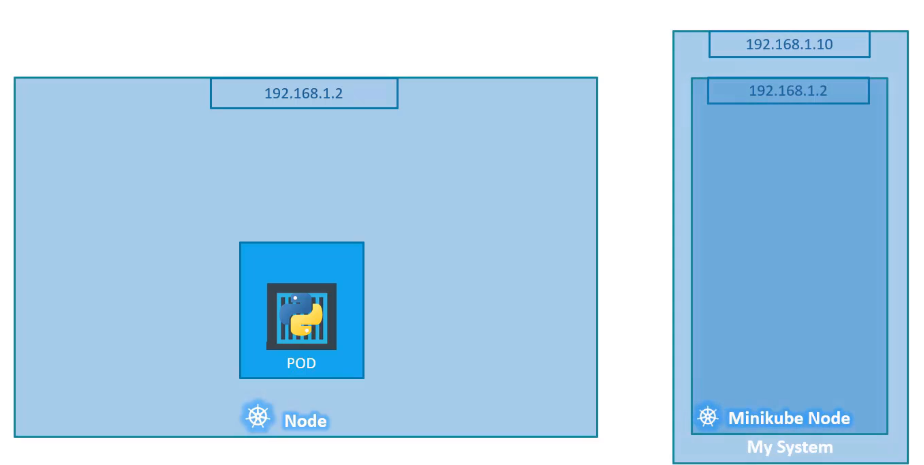
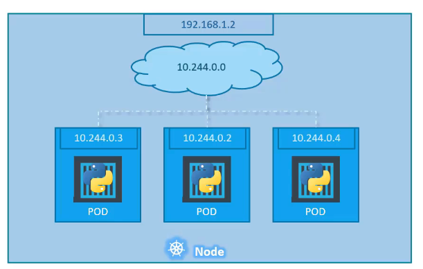
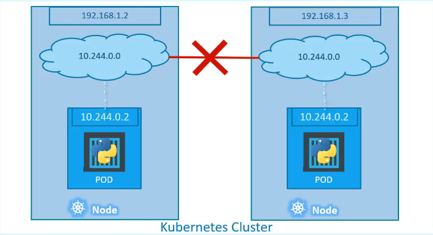
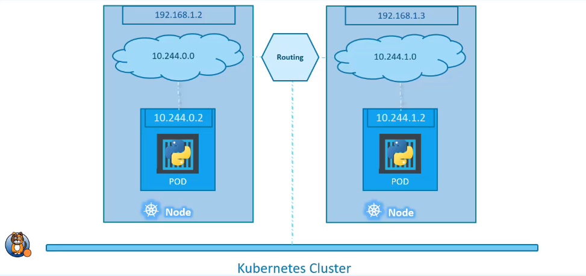

# Networking in Kubernetes

Networking pada Kubernetes memang sangat challenging karena beberapa perlu kamu tahu bagaimana jaringan komputer berkomunikasi. Kubernetes memiliki mekanisme sharing machine atau virtual machine setiap antara aplikasi-aplikasi. Maka Kubernetes bekerja menggunakan ports yang mana ports tersebut tidak boleh sama dengan yang lainnya untuk menghindari konflik ports.

Kubernetes cluster akan mengalokasikan IP Address sesuai kebutuhan dari masing-masing misalkan Pods, Services dan Nodes dengan alokasi IP Addreses yang sudah dikonfigurasi oleh komponen:
* **Network plugin** sudah dikonfigurasi dan di set IP Address untuk setiap Pods.
* **Kube-apiserver** dikonfigurasikan dan di set IP Address untuk setiap Services.
* Dan **Kubelet** atau **Cloud-controller-manager** dikonfigurasikan dan di set IP Addresss untuk Nodes.

Kita bisa lihat dan dibayangkan interkoneksi dari Pods memiliki IP Address local yang mana itu di assign oleh sistem local kita (Docker) sehingga bisa komunikasi antar Pods.

Jika kita memiliki banyak Pods yang sedang berjalan maka, Kubernetes akan otomatis membuat IP Address di setiap masing-masing Pods sehingga anggapannya setiap Pods itu server baru yang berbeda, walaupun secara kenyataan pada Cloud disimpan dalam satu Node saja misalkan.

Mekanisme IP Addressess ini terutama pada Pods sudah ditentukan dan otomatis dijalankan ketika Pods tersebut dibuat agar saat Pods tersebut berkomunikasi akan melalui jalur Nework tersebut.

Bagaimana jika kita memiliki beberapa Kubernetes Cluster yang mana tiap Node pasti kemungkinan memiliki IP Address yang sama?

* Semua Pods bisa komunikasi hanya dalam satu Node saja tanpa perlu NAT (Network Address Translation)
* Semua Nodes bisa berkomunikasi dengan semua Pods tetapi perlu NAT (Network Address Translation) 

Pada level ini network perlu pembantu yang bisa menghubungkan antar Nodes pada Kubernetes diantaranya
* Cisco ACI Network Psyllium
* Big Cloud
* Fabric
* Flannel
* VMware
* Zest
* Calico
tergantu pada Platform yang kamu gunakan saat deploy Kubernetes Cluster yang sedang berjalan.

