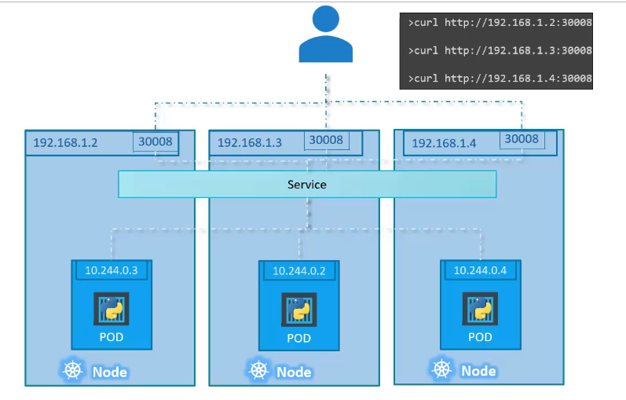

# Kubernetes Services

Kubernetes Service memberikan komunikasi antar komponen di dalam ataupun diluar dari aplikasi. Kubernetes Services ini akan membantu menghubungkan aplikasi satu sama lain terhubung dengan pengguna juga.

Contohnya, aplikasi kita memiliki kelompok-kelompok yang berjalan dari beberapa bagian misalkan kelompok *frontend* atau proses kelompok *backend* ataupun kelompok *third party* yang terhubung untuk saling berkomunikasi dengan data eksternal. Dengan Kubernetes Services kita bisa menghubungkan semua kelompok yang terhubung dengan Kubernetes ini.

Tipe-tipe Kubernetes Services terdapaat 3 yaitu:
a. **NodePort**, service yang dibuat untuk internal Port yang ada pada Nodes.
    
b. **ClusterIP**, virtual IP ddress yang ada pada Cluster untuk mengaktifkan komunikasi didalamnya.
c. **LoadBalancer**, services yang bisa menghubungkan antar set misalkan frontend dan backend pada aplikasi kita.

## Implementasi NodePort
Berikut ini contoh membuta service dengan mengimplementsikna *NodePort*
```yaml
apiVersion: v1
kind: Service
metadata:
  name: myapp-service
spec:
  type: NodePort
  ports:
    - port: 80
      targetPort: 80
      nodePort: 30008
  selector:
    app: myapp
    type: front-end
```

Terlihaat pada file YAAML diatas kita mendapatkan fields baru `Port` yang target node port dan lainnya.

Selanjutnya kita coba create service tersebut dengan perintah dibawah ini.
```bash

➜ kubectl create -f code/services/service-nodeport-definition.yaml
service/myaapp-service created
```

Dan kita lihat jika sudah terbuat maka akan terlihat seperti dibawah ini.
```bash
➜ kubectl get services
NAME             TYPE        CLUSTER-IP      EXTERNAL-IP   PORT(S)        AGE
kubernetes       ClusterIP   10.96.0.1       <none>        443/TCP        24d
myaapp-service   NodePort    10.101.173.39   <none>        80:30008/TCP   71s
```

Bisa kita lihat juga diagram dibawah ini gambaran konfigurasi service NodePort yang sudah kita terapkan.


Dan ketika kita gunakan nodeport tersebut untuk multiple node maka gambarannya akan seperti dibawah ini.



untuk melihat service kita berjalan dengan URL yang sudah dipublish oleh minikube maka kita perlu melihat URL-nya dengan perintah dibawah ini.
```bash
➜ minikube service myapp-service --url
http://127.0.0.1:50569
```


## Penjelasan ClusterIP
Seperti yang sudah dijelaskan diatas secara singkat, ClusterIP ini bisa kita gunakan untuk membagi-bagi alokasi IP Address sehingga menjadi suatu cluster yang saling berkumpul satu sama lain sesuai dengan kebutuhannya misalkan kita ingin membuat clusterIP menjadi seperti `backend`, `frontend`, dan `redis` seperti gambaran dibawah ini.


Dan bagaimana kita bisa membuat ClusterIP tersebut berikut ini contoh create file YAML.
```yaml
apiVersion: v1
kind: Service
metadata:
  name: back-end
spec:
  type: ClusterIP
  ports:
    - port: 80
      targetPort: 80
  selector:
    app: myapp
    type: back-end
```

lalu kita buat servicenya dengan perintah dibawah ini.
```bash
➜ kubectl create -f code/services/service-clusterip-definition.yaml 
service/back-end created
```

Dan kita akan melihat apakah cluster yang kita definisikan sudah terbuat dengan menggunakan perintah dibawah ini.
```bash
➜ kubectl get svc
NAME            TYPE        CLUSTER-IP       EXTERNAL-IP   PORT(S)        AGE
back-end        ClusterIP   10.97.219.53     <none>        80/TCP         7s
kubernetes      ClusterIP   10.96.0.1        <none>        443/TCP        24d
myapp-service   NodePort    10.106.237.142   <none>        80:30008/TCP   18m
```

## Implementasi LoadBalancer
Jenis yang terakhir yaitu LoadBalancer yang mana ini adalah tipe yang bisa menggabungkan dari tiap nodes untuk setiap aplikasi yang sudah kita buat. Nah bagaimana caranya jika kita ingin membuat Loadbalancer? Lihatlah kode dibawah ini.
```yaml
apiVersion: v1
kind: Service
metadata:
  name: myapp-loadbalancer
spec:
  type: LoadBalancer
  ports:
    - port: 80
      targetPort: 80
      nodePort: 30009
```

lalu kita buat service-nya dengan perintah dibawah ini.
```bash
➜ kubectl create -f code/services/service-loadbalancer-definition.yaml
service/myapp-loadbalancer created
```

Dan kita akan melihat apakah cluster yang kita definisikan sudah terbuat dengan menggunakan perintah dibawah ini.
```bash
➜ kubectl get svc
NAME                 TYPE           CLUSTER-IP       EXTERNAL-IP   PORT(S)        AGE
back-end             ClusterIP      10.97.219.53     <none>        80/TCP         8m45s
kubernetes           ClusterIP      10.96.0.1        <none>        443/TCP        24d
myapp-loadbalancer   LoadBalancer   10.99.140.200    <pending>     80:30009/TCP   21s
myapp-service        NodePort       10.106.237.142   <none>        80:30008/TCP   27m
```