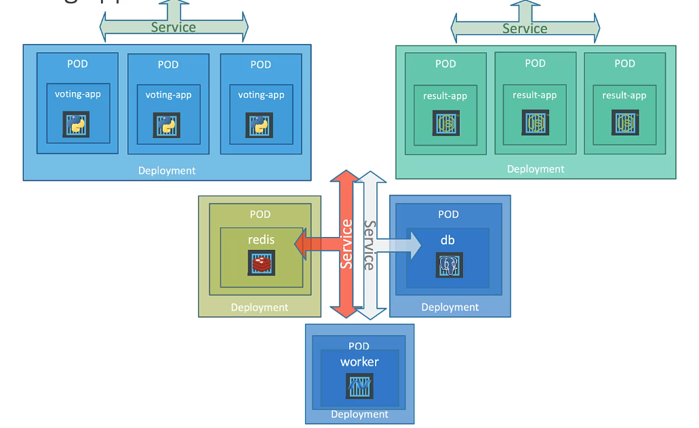
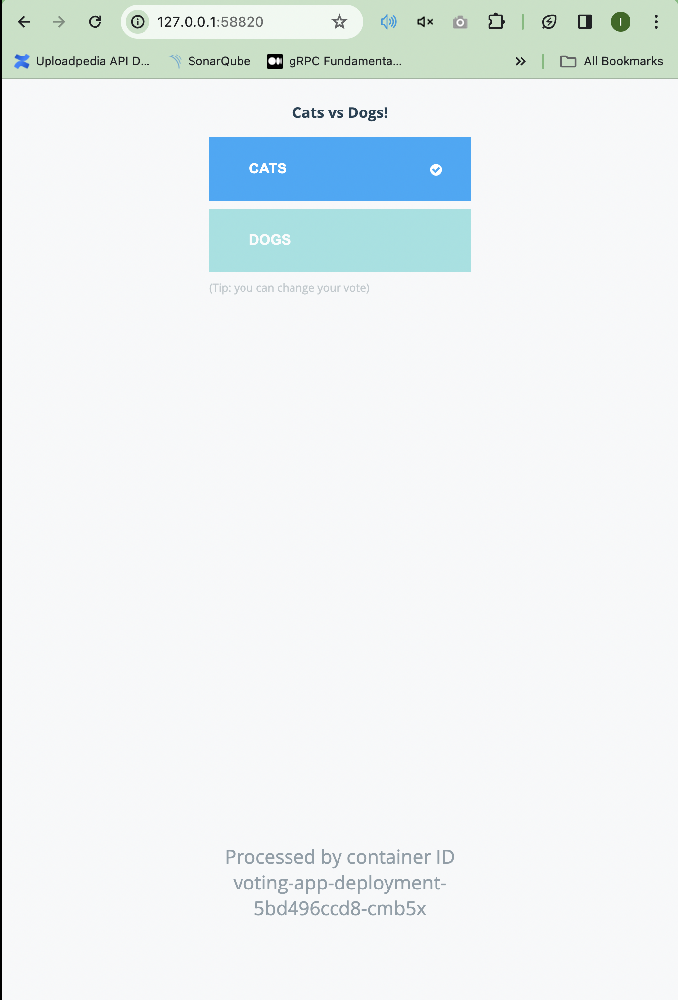
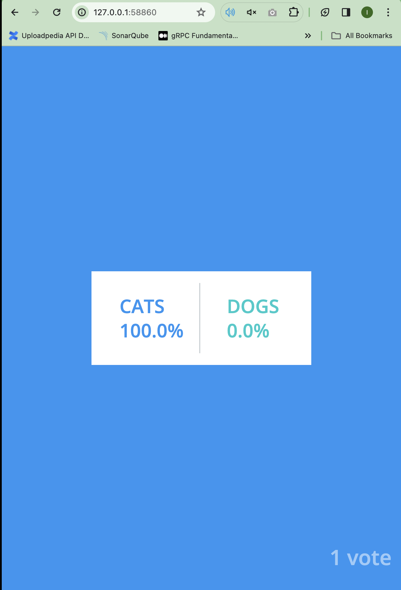

# Mengimplementasikan Microservices Architecture menggunakan Kubernetes

Pada kesempatan ini kita akan mencoba membuat aplikasi yang sudah mengimplementasikan Microservice Architecture dengan menggunakan Kubernetes. Agar lebih tergambar bagaimana kita akan mencoba membuatnya yaitu kita bisa melihat gambar dibawah ini.



Pada gambar terlihat kita memiliki Aplikasi `voting-app`, `result-app` dan `worker` dimana pendukung dari semua aplikasi tersebut yaitu membutuhkan Redis sebagai cache dan Postgre sebagai data penyimpanan dari setiap voting yang akan dilakukan oleh aplikasi.

Berikut ini penjelasan lebih lengkapnya:
1. Voting-App: website yang digunakan untuk melakukan voting berbasis web
2. Result-App: website yang menampilkan hasil voting secara realtime.
3. Worker: aplikasi background proses yang melakukan sinkronisasi dari voting dengan hasil voting secara langsung.
4. Redis: mekanisme penyimpanan sementara yang digunakan untuk mendukung voting-app.
5. Postgre: sebagai data simpan permanent yang nantinya digunakan untuk menampilkan hasil dari semua voting yang sedang berjalan.

Setelah kita tahu semua fungsi dari tiap Pods maka kita perlu menganalisis apa saja yang harus dibuat jika arsitektur aplikasinya seperti ini.

Tahapan microservice ini bisa di deploy ke dalam kubernetes maka perlu analisis sehingga menghasilkan seperti ini:
1. Deploy PODs: kita analisis setiap service atau aplikasi menjadi masing-masing Pods yaitu:
   a. voting-app
   b. result-app
   c. worker
   d. Redis
   e. Postgres
   Tahapan ini berarti nantinya kita akan membuat Pods dengan masing-masing kebutuhannya.
2. Membuat Services (ClusterIP) kita buat agar setiap service bisa berkomunikasi ke dalam Redis dan Postgres. Kenapa kita menggunakan ClusterIP? karena kebutuhan Redis dan Postgres itu kita akses dari aplikasi hanya menggunakan clusternya saja tidak langsung ke Node tertentu.
   a. Redis
   b. Postgres
3. Membuat services (NodePort) digunakan untuk komunikasi dari aplikasi terhadap User sehiigga nantinya setiap website bisa diakses oleh pengguna.
   a. voitng-app
   b. result-app


Tahapannya sudah terbayang maka kita akan coba mengimplementasikannya dalam bentuk file YAML sehingga kita bisa lebih paham.

## Membuat Deployment
Seperti yang sudah dijelaskan diatas tahapan pertama yang perlu kita lakukan yaitu membuat masing-masing PODs menjadi file YAML deployment.

### Membuat voting-app Deployments
Kita coba buat file dengan nama `voting-app-deployment.yaml` dan isi file tersebut seperti dibawah ini.
```yaml
apiVersion: apps/v1
kind: Deployment
metadata:
  name: voting-app-deployment
  labels:
    app: demo-voting-app
spec:
  replicas: 3
  selector:
    matchLabels:
      name: voting-app-pod
      app: demo-voting-app
  template:
    metadata:
      name: voting-app-pod
      labels:
        name: voting-app-pod
        app: demo-voting-app

    spec:
      containers:
      - name: voting-app
        image: dockersamples/examplevotingapp_vote
        ports:
        - containerPort: 80
```

Pada file tersebut kita akan mereplikasi service kita menjadi 3 sehingga nanti akan terlihat service voting-app 3 Pods.

lalu selanjutnya kita create dengan perintah dibawah ini
```bash
➜ kubectl create -f code/demo/voting-app/voting-app-deployment.yaml 
pod/voting-app-deployment created
```

### Membuat result-app Deployments
Kita lanjut dengan membuat file dengan nama `result-app-deployment.yaml` dan isi file tersebut dengan kode dibawah ini.
```yaml
apiVersion: apps/v1
kind: Deployment
metadata:
  name: result-app-deployment
  labels:
    app: demo-voting-app
spec:
  replicas: 1
  selector:
    matchLabels:
      name: result-app-pod
      app: demo-voting-app
  template:
    metadata:
      name: result-app-pod
      labels:
        name: result-app-pod
        app: demo-voting-app

    spec:
      containers:
      - name: result-app
        image: dockersamples/examplevotingapp_result
        ports:
        - containerPort: 80
```

Untuk service result-app kita buat replikasinya 1 saja karena tidak perlu memiliki kebutuhan yang banyak.

lalu dilanjutkan create dengan perintah ini
```bash
➜ kubectl create -f code/demo/result-app/result-app-deployment.yaml 
pod/result-app-deployment created
```

### Membuat worker-app Deployment
Kita lanjut dengan membuat file dengan nama `worker-app-deployment.yaml` dan isi file tersebut dengan kode dibawah ini.
```yaml
apiVersion: apps/v1
kind: Deployment
metadata:
  name: worker-app-deployment
  labels:
    app: demo-voting-app
spec:
  replicas: 3
  selector:
    matchLabels:
      name: worker-app-pod
      app: demo-voting-app
  template:
    metadata:
      name: worker-app-pod
      labels:
        name: worker-app-pod
        app: demo-voting-app

    spec:
      containers:
      - name: worker-app
        image: dockersamples/examplevotingapp_worker
```

Kita buat replikasinya sebesar 3 jika dilihat dari file YAML tersebut. Lalu dilanjutkan create dengan perintah ini
```bash
➜ kubectl create -f code/demo/worker-app/worker-app-deployment.yaml 
pod/worker-app-deployment created
```

### Membuat Redis Deployment
Redis deployment ini digunakan untuk penyimpanan sementara dengan membuat file dibawah ini
```yaml
apiVersion: apps/v1
kind: Deployment
metadata:
  name: redis-deployment
  labels:
    app: demo-voting-app
spec:
  replicas: 1
  selector:
    matchLabels:
      name: redis-pod
      app: demo-voting-app
  template:
    metadata:
      name: redis-pod
      labels:
        name: redis-pod
        app: demo-voting-app

    spec:
      containers:
      - name: redis
        image: redis
        ports:
        - containerPort: 6379
```

Redis biasanya memiliki standar Port yaitu `6379` walaupun sebenarnya bisa berapapun tetapi agar sesuai dengan standar aplikasi maka kita set sesuai kebutuhannya.

lalu dilanjutkan create dengan perintah ini
```bash
➜ kubectl create -f code/demo/redis/redis-deployment.yaml 
pod/redis-deployment created
```

### Membuat Postgres Deployment
Postgres Pods ini digunakan untuk penyimpanan permanen untuk hasil akhir dari voting app tersebut dengan membuat file dibawah ini
```yaml
apiVersion: apps/v1
kind: Deployment
metadata:
  name: postgres-deployment
  labels:
    app: demo-voting-app
spec:
  replicas: 1
  selector:
    matchLabels:
      name: postgres-pod
      app: demo-voting-app
  template:
    metadata:
      name: postgres-pod
      labels:
        name: postgres-pod
        app: demo-voting-app

    spec:
      containers:
      - name: postgres
        image: postgres:9.4
        ports:
        - containerPort: 5432
        env:
          - name: POSTGRES_HOST_AUTH_METHOD
            value: trust
```

Postgres sebagai database pun kita set Port `5432` karena standar dari postgres menggunakan port tersebut.

Dan kita juga menambahkan `environment` seperti user dan password yang digunakan untuk koneksi ke dalam database postgres.
* POSTGRES_HOST_AUTH_METHOD = trust

lalu dilanjutkan create dengan perintah ini
```bash
➜ kubectl create -f code/demo/postgres/postgres-deployment.yaml 
pod/postgres-deployment created
```

## Membuat Services
Ada dua tipe services yang akan kita pakai pada aplikasi ini dengan yaitu ClusterIP dan NodePort.

### Cluster IP untuk Redis
Kita akan membuat service ClusterIP untuk Redis agar bisa berkomunikasi dengan aplikasi voting kita yaitu dengan kode dibawah ini.
```yaml
apiVersion: v1
kind: Service
metadata:
  name: redis
  labels:
    name: redis-service
    app: demo-voting-app
spec:
  ports:
  - port: 6379
    targetPort: 6379
  selector:
    name: redis-pod
    app: demo-voting-app
```

### ClusterIP untuk Postgres
Membuat ClusterIP untuk Postgres agar service kita bisa berkomunikasi dengan database. Berikut ini kode YAML service yang perlu kita buat.
```yaml
apiVersion: v1
kind: Service
metadata:
  name: db
  labels:
    name: db-service
    app: demo-voting-app
spec:
  ports:
  - port: 5432
    targetPort: 5432
  selector:
    name: postgres-pod
    app: demo-voting-app
```

### LoadBalancer untuk voting-app
Tipe pada voting-app adalah NodePort karena kita akan meng-establish port ke pengguna sehingga menggunakan NodePort. Berikut file YAML yang harus kita buat.
```yaml
apiVersion: v1
kind: Service
metadata:
  name: voting-service
  labels:
    name: voting-service
    app: demo-voting-app
spec:
  type: LoadBalancer
  ports:
  - port: 80
    targetPort: 80
  selector:
    name: voting-app-pod
    app: demo-voting-app
```

### LoadBalancer untuk result-app
Tipe pada result-app adalah NodePort juga karena kita akan meng-establish port ke pengguna sehingga menggunakan NodePort. Berikut file YAML yang harus kita buat.
```yaml
apiVersion: v1
kind: Service
metadata:
  name: result-service
  labels:
    name: result-service
    app: demo-voting-app
spec:
  type: LoadBalancer
  ports:
  - port: 80
    targetPort: 80
  selector:
    name: result-app-pod
    app: demo-voting-app
```

Buat semua service tersebut dengan perintah dibawah ini.
```bash
➜ kubectl create -f code/demo/postgres/postgres-service.yaml 
service/db created
➜ kubectl create -f code/demo/redis/redis-service.yaml      
service/redis created
➜ kubectl create -f code/demo/voting-app/voting-app-service.yaml 
service/voting-service created
➜ kubectl create -f code/demo/result-app/result-app-service.yaml 
service/result-service created
```

Jika ingin melihat semuanya bisa kita gunakan terminal dengan perintah dibawah ini.
```bash
➜ kubectl get all                                                  
NAME                                         READY   STATUS    RESTARTS   AGE
pod/postgres-deployment-7d47dd5bd8-hrsgq     1/1     Running   0          54s
pod/redis-deployment-58bdbddb55-6x4nk        1/1     Running   0          46s
pod/result-app-deployment-6ff54bbb5-9gz7q    1/1     Running   0          37s
pod/voting-app-deployment-5bd496ccd8-cmb5x   1/1     Running   0          28s
pod/voting-app-deployment-5bd496ccd8-nq4zl   1/1     Running   0          28s
pod/voting-app-deployment-5bd496ccd8-tqhwt   1/1     Running   0          28s
pod/worker-app-deployment-785b6c695d-28np4   1/1     Running   0          16s
pod/worker-app-deployment-785b6c695d-2gfnz   1/1     Running   0          16s
pod/worker-app-deployment-785b6c695d-gz7jx   1/1     Running   0          16s

NAME                     TYPE           CLUSTER-IP      EXTERNAL-IP   PORT(S)        AGE
service/db               ClusterIP      10.97.181.193   <none>        5432/TCP       51s
service/kubernetes       ClusterIP      10.96.0.1       <none>        443/TCP        25d
service/redis            ClusterIP      10.109.77.202   <none>        6379/TCP       44s
service/result-service   LoadBalancer   10.100.125.49   <pending>     80:31289/TCP   34s
service/voting-service   LoadBalancer   10.97.64.194    <pending>     80:31266/TCP   23s

NAME                                    READY   UP-TO-DATE   AVAILABLE   AGE
deployment.apps/postgres-deployment     1/1     1            1           54s
deployment.apps/redis-deployment        1/1     1            1           46s
deployment.apps/result-app-deployment   1/1     1            1           37s
deployment.apps/voting-app-deployment   3/3     3            3           28s
deployment.apps/worker-app-deployment   3/3     3            3           16s

NAME                                               DESIRED   CURRENT   READY   AGE
replicaset.apps/postgres-deployment-7d47dd5bd8     1         1         1       54s
replicaset.apps/redis-deployment-58bdbddb55        1         1         1       46s
replicaset.apps/result-app-deployment-6ff54bbb5    1         1         1       37s
replicaset.apps/voting-app-deployment-5bd496ccd8   3         3         3       28s
replicaset.apps/worker-app-deployment-785b6c695d   3         3         3       16s
```

Terlihat semua services sudah berjalan dengan melihat status `Running` dan agar kita bisa mencobanya pada browser kita bisa gunakan perintah dibawah ini untuk service voting-app.
```bash
➜ minikube service voting-service --url
http://127.0.0.1:58820
❗  Because you are using a Docker driver on darmoveStaleState removing state" podUID="b50bbc4f-004b-4d1f-86cf-db77a85b0f7d" containerName="redi
```

Jika kita akses menggunakan browser akan terlihat seperti gambar dibawah ini.


Dan untuk service result-app, kita juga perlu lihat dengan perintah dibawah ini.
```bash
➜ minikube service result-service --url
http://127.0.0.1:58860
❗  Because you are using a Docker driver on darwin, the terminal needs to be open to run it.
```

Jika kita lihat dan akses menggunakan browser untuk service result-app akan terlihat seperti gambar dibawah ini.


