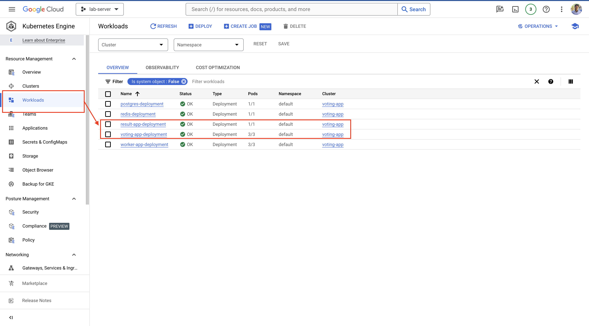

# Deployment Services on Google Kubernetes Engine Cloud

Pada kali ini kita akan coba untuk melakukan deployment service kita ke dalam Server Google Cloud Platform. Pada Google Cloud sudah disediakan khusus untuk deployment berbentuk Kubernetes yaitu berupa Google Kubernetes Engine sehingga ketika kita ingin mendeploy service kita menjadi lebih mudah.

Perlu diketahui juga, jika kita belum berlangganan google cloud maka kita perlu terlebih dahulu melakukan langganan atau daftar secara gratis bagi tahun pertama untuk bisa menggunakan google cloud dengan akun gmail masing-masing.

Jadi, kita coba akses website google cloud pada situs ini [Google Cloud](https://cloud.google.com/free/?utm_source=google&utm_medium=cpc&utm_campaign=japac-ID-all-en-dr-BKWS-all-core-trial-EXA-dr-1605216&utm_content=text-ad-none-none-DEV_c-CRE_602397324903-ADGP_Hybrid+%7C+BKWS+-+EXA+%7C+Txt+-GCP-General-core+brand-main-KWID_43700071562408538-aud-970366092687:kwd-6458750523&userloc_9125808-network_g&utm_term=KW_google+cloud&gad_source=1&gclid=CjwKCAjwnv-vBhBdEiwABCYQA6rws2PlBliWGvWsriJrNZmZKzBikhnhavCOFp4QvMdqyXhxgDcEMxoCpF8QAvD_BwE&gclsrc=aw.ds&hl=id) dan pilih console atau daftar jika belum memiliki akses ke dalam Google Cloud.

## Persiapan Membuat Kubernetes Cluster
Persiapan jika kita ingin mendeploy service kita di GKE maka perlu dilakukan tahapan-tahapan seperti berikut ini.
1. Create Cluster Kubernetes pada Google cloud, jika ingin lebih paham baca beberapa step disana dan bisa juga kita lakukan custom dari mulai spesifikasi virtual cloud seperti kebutuhan memory, cpu dan lainnya.
     
2. Pilih tombol create setelah semua konfigurasi sudah setting, atau jika ingin default maka langsung saja tekan tombol create sampai tunggu cluster tersebut sukses dibuat seperti dibawah ini.
    
3. Jika sudah selesai kita lanjut dengan pilih `Connect` ke dalam cluster yang sudah kita buat.
    
4. Maka akan muncul pop up dan lalu copy terminalnya dan pilih `Run in Cloud Shell`
    
5. Akan muncul terminal di tampilan paling bawah lalu enter dan tunggu sampai selesai semuanya berjalan.
    
    Jika sudah terlihat pada terminal seperti dibawah ini berarti proses sudah selesai
    ```bash
    ihsan_android@cloudshell:~ (genial-upgrade-162704)$ gcloud container clusters get-credentials voting-app --region asia-southeast1 --project genial-upgrade-162704
    Fetching cluster endpoint and auth data.
    kubeconfig entry generated for voting-app.
    ```
6. Siapkan template file YAML yang sebelumnya kita sudah buatkan atau bisa clone di github [ini](https://github.com/ihsanarif/kubernetes-for-beginners)
    ```bash
    git clone https://github.com/ihsanarif/kubernetes-for-beginners.git
    cd kubernetes-for-beginners/
    ls -l
    total 20
    drwxr-xr-x 7 ihsan_android ihsan_android 4096 Mar 25 07:03 demo
    drwxr-xr-x 2 ihsan_android ihsan_android 4096 Mar 25 07:03 deployments
    drwxr-xr-x 2 ihsan_android ihsan_android 4096 Mar 25 07:03 pod
    drwxr-xr-x 2 ihsan_android ihsan_android 4096 Mar 25 07:03 replicasets
    drwxr-xr-x 2 ihsan_android ihsan_android 4096 Mar 25 07:03 services
    ```
7. Coba lihat semua file yang terdapat pada file yang sudah di clone di repository tersebut, lalu siapkan perintah dibawah ini untuk mendeploy semua service
    ```bash
    kubectl create -f demo/voting-app/voting-app-deployment.yaml
    kubectl create -f demo/voting-app/voting-app-service.yaml
    kubectl create -f demo/result-app/result-app-deployment.yaml
    kubectl create -f demo/result-app/result-app-service.yaml
    kubectl create -f demo/redis/redis-deployment.yaml
    kubectl create -f demo/redis/redis-service.yaml
    kubectl create -f demo/postgres/postgres-deployment.yaml
    kubectl create -f demo/postgres/postgres-service.yaml
    kubectl create -f demo/worker-app/worker-app-deployment.yaml
    ```
8. Tunggu beberapa menit atau lihat untuk memastikan statusnya sudah berjalan atau belum dengan perintah dibawah ini
    ```bash
    kubectl get svc,deployment,pods
    ```
    Maka jika hasilnya akan seperti dibawah ini.
    ```bash
    NAME                     TYPE           CLUSTER-IP       EXTERNAL-IP   PORT(S)        AGE
    service/db               ClusterIP      34.118.225.53    <none>        5432/TCP       44s
    service/kubernetes       ClusterIP      34.118.224.1     <none>        443/TCP        36m
    service/redis            ClusterIP      34.118.230.85    <none>        6379/TCP       45s
    service/result-service   LoadBalancer   34.118.239.230   <pending>     80:30140/TCP   47s
    service/voting-service   LoadBalancer   34.118.230.44    <pending>     80:31376/TCP   50s

    NAME                                    READY   UP-TO-DATE   AVAILABLE   AGE
    deployment.apps/postgres-deployment     0/1     1            0           45s
    deployment.apps/redis-deployment        0/1     1            0           46s
    deployment.apps/result-app-deployment   0/1     1            0           47s
    deployment.apps/voting-app-deployment   0/3     3            0           51s
    deployment.apps/worker-app-deployment   0/3     3            0           42s

    NAME                                         READY   STATUS    RESTARTS   AGE
    pod/postgres-deployment-c9fdd58fd-ftljj      0/1     Pending   0          45s
    pod/redis-deployment-5989f8dddf-jbtrg        0/1     Pending   0          46s
    pod/result-app-deployment-5d9f49b9ff-mrc2g   0/1     Pending   0          47s
    pod/voting-app-deployment-65684bb646-5q2gc   0/1     Pending   0          49s
    pod/voting-app-deployment-65684bb646-6cbph   0/1     Pending   0          49s
    pod/voting-app-deployment-65684bb646-rgr56   0/1     Pending   0          50s
    pod/worker-app-deployment-fd4cb7b6d-4wmg2    0/1     Pending   0          42s
    pod/worker-app-deployment-fd4cb7b6d-6p4j5    0/1     Pending   0          42s
    pod/worker-app-deployment-fd4cb7b6d-nl25s    0/1     Pending   0          42s
    ```
     
9. Jika kita ingin melihat IP Public dari service `voting-app` dan `result-app` maka kita perlu lihat di **workfload** menu
    
10. Bisa kita lihat IP Public voucher tersebut dengan tampilan seperti ini.
     
11. Jika sudah mendapatkan IP Address Public-nya maka akan tampil pada browser seperti ini.
    
    Voting App
    
    Result App